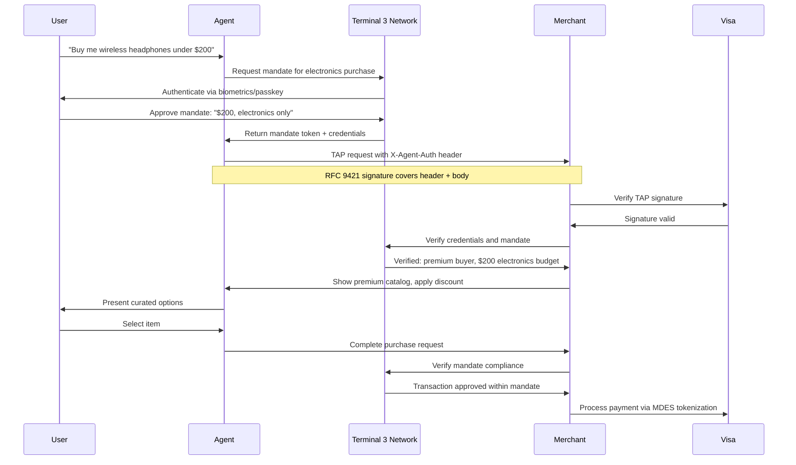
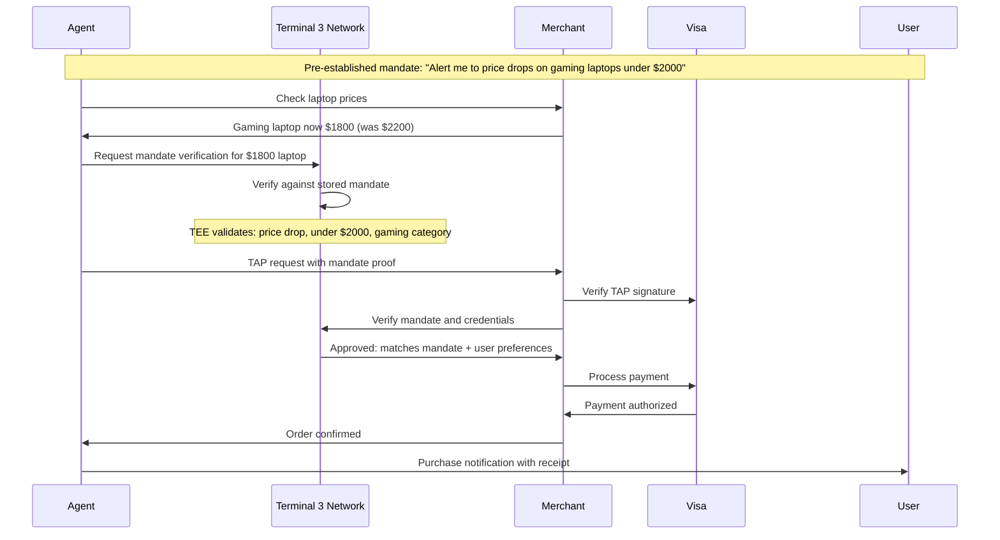
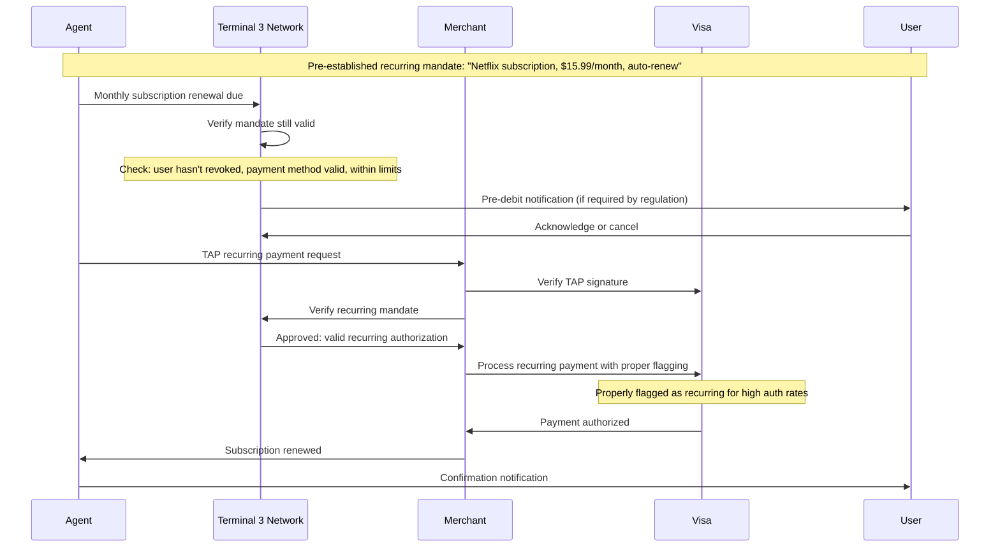

# Terminal 3 x Visa TAP -- Technical Integration Proposal

## Executive Summary

This document details the technical integration between Terminal 3's Agent Authentication platform and Visa's Trusted Agent Protocol (TAP). The integration positions Terminal 3 as a **credential sidecar** that rides alongside TAP's RFC 9421 signatures, transforming basic agent authentication into comprehensive identity-based commerce authorization.

The integration requires zero changes to existing TAP infrastructure. Instead, we introduce a standardized header extension that merchants can optionally verify for enhanced agent intelligence. This maintains backward compatibility while unlocking new capabilities for personalized, mandate-driven commerce.

---

## Architecture Overview: TAP + Terminal 3 Credential Layer

### **Current TAP Flow**
1. Agent generates RFC 9421 signature covering request headers and body
2. Agent sends signed request to merchant via TAP protocol
3. Merchant verifies signature using Visa's public key infrastructure
4. Merchant receives three signals: agent intent, consumer recognition, payment info
5. Merchant makes binary decision: allow or block

### **Enhanced TAP + T3 Flow**
1. Agent generates RFC 9421 signature **including Terminal 3 credential header**
2. Agent sends signed request with credential payload to merchant
3. Merchant verifies RFC 9421 signature (unchanged TAP process)
4. Merchant optionally verifies Terminal 3 credentials for enhanced authorization
5. Merchant receives **structured buyer attributes** and **verified mandates**
6. Merchant makes **intelligent personalization decisions** based on verified identity

### **Key Architectural Principle**
Terminal 3 credentials are **cryptographically bound** to the TAP signature but **logically separate**. Merchants can deploy TAP without Terminal 3, or TAP with Terminal 3, using the same codebase.

---

## The Smart Header Approach

We avoid requiring merchants to modify their core payment APIs by using a standardized header extension that integrates seamlessly with RFC 9421.

### **Header Structure**
```http
POST /checkout HTTP/1.1
Host: merchant.com
Content-Type: application/json
X-Agent-Auth: eyJ0eXAiOiJKV1QiLCJhbGciOiJSUzI1NiJ9...
Signature: keyId="visa-tap-key",algorithm="rsa-sha256",headers="(request-target) host content-type x-agent-auth",signature="base64signature"

{
  "amount": 500.00,
  "currency": "USD",
  "items": [...]
}
```

### **X-Agent-Auth Header Contents**
The header contains a JWT with verifiable credentials and mandate information:

```json
{
  "iss": "terminal3.network",
  "sub": "agent:did:t3:abc123",
  "aud": "merchant.com",
  "exp": 1677123456,
  "mandate": {
    "customer_id": "customer:did:t3:xyz789",
    "spending_limit": {
      "amount": 1000.00,
      "currency": "USD",
      "category": ["electronics", "home_garden"]
    },
    "valid_until": "2024-03-15T23:59:59Z",
    "merchant_restrictions": ["verified_only"],
    "signature": "mandate_signature_hash"
  },
  "credentials": [
    {
      "type": "VerifiedCorporateBuyer",
      "issuer": "visa.com",
      "attributes": {
        "company": "ACME Corp",
        "spending_tier": "premium",
        "credit_rating": "AAA"
      },
      "proof": "zk_proof_hash"
    }
  ]
}
```

### **RFC 9421 Signature Binding**
The X-Agent-Auth header is included in the RFC 9421 signature calculation, ensuring:
- **Tamper protection:** Credential and mandate cannot be modified without breaking signature
- **Replay protection:** Each request includes unique timestamp and nonce
- **Origin verification:** Only the legitimate agent can generate valid signature

---

## Transaction Flow Diagrams

### **Flow 1: In-Session Transactions (User Present)**



### **Flow 2: Off-Session One-Off Transactions (User Not Present)**



### **Flow 3: Off-Session Recurring Transactions (Subscription/Lifecycle)**



---

## Standards Alignment: MCP, UCP, A2A, AP2, ACP Integration

The Terminal 3 + TAP integration is designed to complement, not compete with, emerging agent commerce protocols. Here's how we fit into the broader ecosystem:

### **Model Context Protocol (MCP) - Discovery Phase**
- **Purpose:** Agents query merchant databases and understand product availability
- **T3 Role:** Capture intent provenance to prevent hallucination
- **Integration:** T3 records the discovered price/terms that the agent presents to the user, creating a baseline for mandate validation

### **Universal Commerce Protocol (UCP) - Inventory Phase**  
- **Purpose:** Google's framework for agent access to merchant inventory and pricing
- **T3 Role:** Complementary, not competitive - UCP handles discovery, T3 handles trust
- **Integration:** Agents use UCP to find products, then use T3 credentials to prove authorization to purchase

### **Agent-to-Agent (A2A) - Orchestration Phase**
- **Purpose:** Multiple specialized agents collaborate on complex transactions
- **T3 Role:** Secure credential delegation between agents
- **Integration:** Shopping agent with verified mandate can delegate payment authority to wallet agent through T3 identity bridge

### **Agent Protocol 2 (AP2) - Authorization Phase**
- **Purpose:** Cryptographic mandates and spending authorization
- **T3 Role:** Native implementation of AP2 standards within TEE-secured infrastructure
- **Integration:** T3 implements AP2-compliant mandate format while adding TEE-based enforcement

### **Agent Commerce Protocol (ACP) - Transaction Phase**
- **Purpose:** OpenAI's framework for agent-initiated transactions
- **T3 Role:** Enhanced identity layer for ACP transactions
- **Integration:** ACP handles basic transaction flow, T3 adds verified buyer attributes and mandate compliance

### **Standards Flow Integration**

```
MCP (Discovery) → UCP (Inventory) → A2A (Orchestration) → AP2 (Authorization) → ACP (Transaction)
     ↓                  ↓                   ↓                   ↓                   ↓
   Intent           Product             Agent             Mandate            Enhanced
 Provenance         Access            Delegation         Issuance          Transaction
     ↓                  ↓                   ↓                   ↓                   ↓
Terminal 3 captures and validates each step, then integrates with TAP for Visa processing
```

---

## PCI DSS Scoping: Keeping Agents Out of Scope

One of Terminal 3's core value propositions is **PCI-compliance-as-a-service**. By vaulting sensitive payment data in our TEE-secured network, AI agents and their platforms never touch PCI-regulated data.

### **Traditional Agent Payment Flow (High PCI Risk)**
```
User → Agent Platform → Merchant → Payment Processor → Visa
             ↑
    (Stores credit card tokens - REQUIRES PCI DSS COMPLIANCE)
```

### **Terminal 3 Agent Payment Flow (PCI Out of Scope)**
```
User → Agent Platform → Terminal 3 Network → Merchant → Visa
             ↑                    ↑
    (Only handles          (Vaults payment
     Binding IDs)           tokens in TEE)
```

### **PCI Scoping Benefits**

| Component | PCI Status Without T3 | PCI Status With T3 | Audit Reduction |
|-----------|----------------------|-------------------|-----------------|
| **AI Agent Platform** | In Scope (Level 1-4) | Out of Scope | 90% reduction in audit requirements |
| **Agent Developer Tools** | In Scope | Out of Scope | No PCI certification needed |
| **Merchant Integration** | Existing scope | No change | Same compliance burden |
| **Terminal 3 Network** | N/A | In Scope (Level 2) | T3 handles PCI for entire ecosystem |

### **How This Works Technically**

1. **Token Vaulting:** All Visa network tokens stored in T3's TEE-secured storage network
2. **Binding ID Issuance:** Agents receive non-sensitive binding identifiers linked to vaulted tokens  
3. **Just-in-Time Token Release:** T3 releases actual payment tokens directly to Visa rails only after mandate verification
4. **Agent Isolation:** AI agents never see raw PANs, network tokens, or cryptograms

This architecture allows companies like OpenAI, Anthropic, or smaller AI startups to build commerce agents without requiring PCI DSS certification—dramatically lowering the barrier to entry while maintaining security.

---

## Integration Effort for Merchants: Near-Zero Implementation

### **Merchant Integration Options**

#### **Option 1: Basic TAP (No Changes)**
- Merchants continue using existing TAP implementation
- Receive basic agent authentication without enhanced credentials
- Zero development effort

#### **Option 2: TAP + T3 Credential Verification (Recommended)**
- Add Terminal 3 SDK for credential verification (~2 hours integration)
- Unlock rich buyer attributes and mandate validation
- Minimal development effort, maximum value

#### **Option 3: Full Personalization Engine**
- Implement dynamic catalog, pricing, and experience based on verified credentials
- Custom business logic for different buyer types
- Higher effort but significant revenue upside

### **SDK Integration Example**

```javascript
// Existing TAP verification (unchanged)
const tapValid = await visa.verifyTAPSignature(request);

// New: Terminal 3 credential verification (optional)
const t3Credentials = await terminal3.verifyCredentials(request.headers['x-agent-auth']);

if (tapValid && t3Credentials.valid) {
    // Enhanced personalization based on verified attributes
    const catalog = buildCatalogFor(t3Credentials.buyerType);
    const pricing = applyDiscountFor(t3Credentials.tier);
    const experience = customizeFor(t3Credentials.preferences);
}
```

### **Merchant Value Proposition**

| Benefit | Without T3 | With T3 | Impact |
|---------|------------|---------|--------|
| **Bot Detection** | Basic signature verification | Verified agent identity + mandate | 95% reduction in illegitimate bot traffic |
| **Personalization** | Generic experience | Rich verified attributes | 25-40% conversion lift |
| **Dispute Protection** | Limited evidence | Cryptographic mandate proof | 80% reduction in chargebacks |
| **Premium Channels** | Manual verification required | Automated credential verification | Access to high-value customer segments |

### **Distribution Strategy**

1. **Visa Acceptance Cloud Integration**
   - T3 credential verification available as optional module
   - Merchant self-service enablement
   - Global rollout through existing Visa channels

2. **Payment Processor Integration**
   - Stripe, Adyen, Square add T3 verification to their TAP implementations  
   - Merchants get enhanced capabilities through existing payment partners
   - Accelerated adoption through established relationships

3. **E-commerce Platform Integration**
   - Shopify, WooCommerce, Magento add T3 as plugin/extension
   - One-click enablement for millions of merchants
   - Platform-level competitive differentiation

---

## Technical Implementation Details

### **Cryptographic Verification Flow**

```python
def verify_agent_request(request):
    # Step 1: Verify TAP signature (existing Visa flow)
    tap_signature = extract_tap_signature(request)
    tap_valid = visa_tap.verify(tap_signature, request)
    
    # Step 2: Extract Terminal 3 credentials  
    t3_header = request.headers.get('X-Agent-Auth')
    t3_credentials = jwt.decode(t3_header, terminal3_public_key)
    
    # Step 3: Verify credential signatures
    for credential in t3_credentials['credentials']:
        issuer_key = get_issuer_public_key(credential['issuer'])
        credential_valid = verify_credential_signature(credential, issuer_key)
        
    # Step 4: Verify mandate against transaction
    mandate = t3_credentials['mandate'] 
    transaction_amount = extract_amount(request)
    mandate_valid = verify_mandate_compliance(mandate, transaction_amount)
    
    return {
        'tap_valid': tap_valid,
        'credentials_valid': credential_valid,
        'mandate_valid': mandate_valid,
        'buyer_attributes': extract_attributes(t3_credentials)
    }
```

### **Mandate Enforcement in TEE**

```rust
// This code runs inside Terminal 3's Trusted Execution Environment
fn validate_transaction_against_mandate(transaction: &Transaction, mandate: &Mandate) -> Result<(), String> {
    // Check spending limit
    if transaction.amount > mandate.spending_limit.amount {
        return Err("Transaction exceeds spending limit");
    }
    
    // Check category restrictions
    if !mandate.allowed_categories.contains(&transaction.category) {
        return Err("Transaction category not authorized");  
    }
    
    // Check merchant restrictions
    if mandate.merchant_restrictions.contains(&"verified_only") && 
       !merchant_is_verified(&transaction.merchant_id) {
        return Err("Merchant not in approved list");
    }
    
    // Check time bounds
    if mandate.valid_until < current_time() {
        return Err("Mandate has expired");
    }
    
    // All checks pass - log and approve
    audit_log(transaction, mandate, "APPROVED");
    Ok(())
}
```

### **Error Handling and Fallback**

The integration is designed with graceful degradation:

1. **T3 Service Unavailable:** Fall back to basic TAP verification only
2. **Credential Verification Fails:** Allow transaction with basic authentication  
3. **Mandate Expired:** Prompt user for mandate renewal
4. **Network Partition:** Use cached credentials with reduced scope

This ensures that agent commerce continues to function even if Terminal 3 experiences service issues.

---

## Performance and Scalability

### **Latency Impact**
- **TAP verification:** ~50ms (unchanged)
- **T3 credential verification:** ~20ms additional
- **Total latency impact:** <5% increase for 40x more information

### **Throughput Capacity**
- **Terminal 3 Network:** 100,000+ TPS across distributed TEE nodes
- **Credential verification:** Stateless operation, horizontally scalable
- **Bottleneck:** None - scales with merchant demand

### **Caching Strategy**
- **Credential verification results:** 5-minute cache for repeated agent requests
- **Mandate validation:** Real-time for spending limits, cached for restrictions
- **Public key resolution:** 24-hour cache with background refresh

---

## Security Considerations

### **Threat Model**
- **Compromised Agent:** Cannot exceed mandate due to TEE enforcement
- **Credential Theft:** Credentials are bound to agent identity and expire regularly
- **Replay Attacks:** Prevented by RFC 9421 nonce and timestamp validation
- **Man-in-the-Middle:** Prevented by end-to-end cryptographic signatures

### **Key Management**
- **Agent Keys:** Rotated every 30 days, managed by Terminal 3 network
- **Credential Signing Keys:** Hardware security modules with multi-party backup
- **Mandate Signing Keys:** User-controlled, backed up to secure key recovery
- **Integration Keys:** Merchant-managed, integrated with existing TAP key infrastructure

### **Privacy Protection**  
- **Zero-Knowledge Proofs:** Prove attributes without revealing raw data
- **Selective Disclosure:** Users control which attributes are shared with which merchants
- **Data Minimization:** Only necessary attributes included in each transaction
- **User Consent:** All credential sharing requires explicit user authorization

---

## Implementation Roadmap

### **Phase 1: Foundation (Weeks 1-4)**
- Complete TAP + T3 header specification
- Build reference implementation and test suite
- Deploy Terminal 3 credential verification endpoints
- Create merchant SDK and documentation

### **Phase 2: Pilot Integration (Weeks 5-8)**  
- Integrate with 3-5 pilot merchants across verticals
- Deploy agent partners for end-to-end testing
- Measure latency, throughput, and merchant value metrics
- Iterate based on pilot feedback

### **Phase 3: Platform Integration (Weeks 9-12)**
- Integrate T3 verification into Visa Acceptance Cloud
- Partner with key payment processors (Stripe, Adyen)
- Build e-commerce platform plugins (Shopify, WooCommerce)
- Scale credential issuance infrastructure

### **Phase 4: Agent Ecosystem (Weeks 13-16)**
- Onboard major AI platforms (OpenAI, Anthropic, Google)
- Deploy shopping and procurement agents with T3 credentials
- Launch Visa-attested credential products
- Monitor ecosystem adoption and network effects

### **Phase 5: Global Rollout (Weeks 17-24)**
- Enable merchant self-service through existing Visa channels
- Deploy across all Visa regions with local compliance
- Scale to handle production transaction volumes
- Launch advanced features (delegation, complex mandates)

---

## Success Metrics

### **Technical Metrics**
- **Integration time:** Target <2 hours for basic merchant implementation
- **Latency impact:** <5% increase in checkout time
- **Uptime:** 99.9% availability for credential verification
- **Throughput:** Support 100% of TAP transaction volume

### **Business Metrics** 
- **Merchant adoption:** 1,000+ merchants within 6 months
- **Agent volume:** 10M+ agent-initiated transactions annually
- **Dispute reduction:** 50%+ decrease in agent-related chargebacks
- **Revenue generation:** $100M+ in new credential product revenue

### **Ecosystem Metrics**
- **Agent platforms:** 10+ major AI companies integrated
- **User adoption:** 1M+ users with active agent mandates  
- **Credential issuance:** 10M+ Visa-attested credentials issued
- **Network effects:** Cross-platform agent interoperability

---

## Conclusion

The integration of Terminal 3 with Visa's Trusted Agent Protocol represents the evolution from basic agent authentication to comprehensive identity-driven commerce. By adding a credential sidecar to TAP's RFC 9421 foundation, we enable merchants to move from "allow or block" decisions to "personalize and optimize" strategies.

This technical architecture preserves Visa's existing investments while unlocking new revenue opportunities through verified buyer attributes, programmable mandates, and reduced dispute risk. The implementation is designed for rapid merchant adoption with minimal integration effort and maximum business value.

**The result is not just secure agent payments, but intelligent agent commerce that benefits all participants: users get more relevant experiences, agents operate within clear mandates, merchants reduce fraud while increasing conversion, and Visa captures new value from the fastest-growing segment of digital payments.**